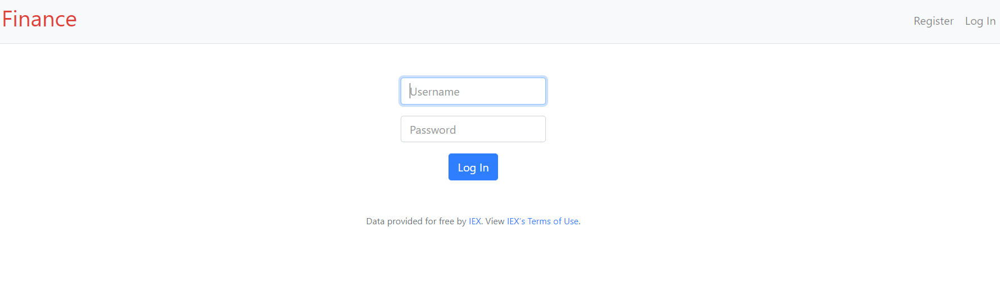
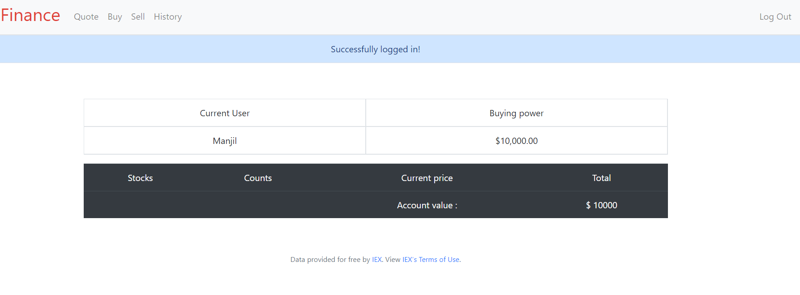

# Stock-And-Investment
Web based app built using Python and Flask.
Users can create there personal protfolio and trade using real-time stock imported using API from IEX cloud.
Well maintained (in SQLite) and displayed information about users balance, buying power, total number of stocks, buy and sell history, monthly/yearly statements.

### To run on your machine:
 * Create  an account on IEX cloud, then run on cli
 `export API_KEY={YOUR_IEX_API_KEY} `
 * Then from home directory:
 `flask run `

## Login page preview:
 
 
 ## Home screen preview:
 
